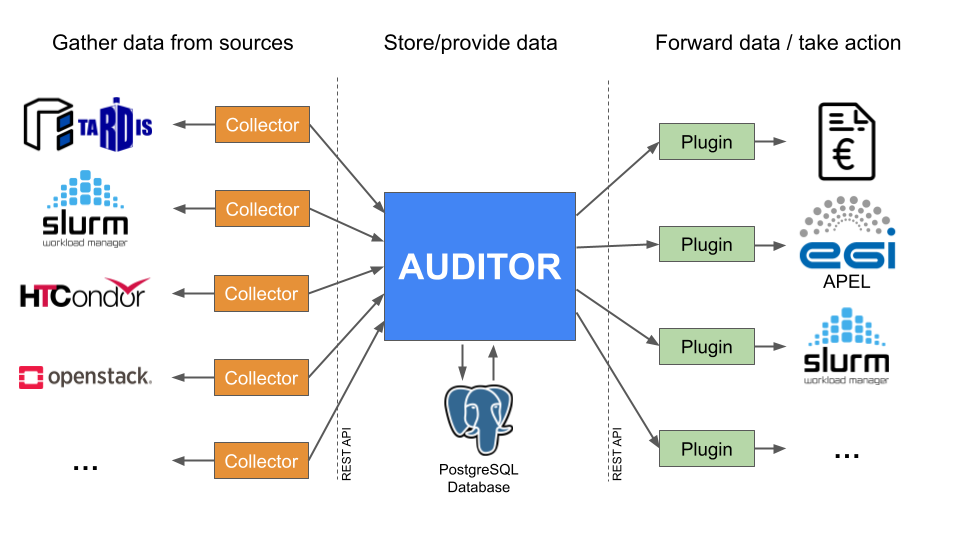

+++
title = "Auditor"
sort_by = "weight"
+++

# Auditor

Auditor stands for **A**cco**u**nting **D**ata Handl**i**ng **T**oolbox For **O**pportunistic **R**esources.
Auditor ingests accounting data provided by so-called *collectors*, stores it and provides it to the outside to so-called *plugins*.

It comes with a well-defined REST API which allows for the implementation of application-specific collectors and plugins. This makes it well suited for a wide range of use cases.

<p align="center">
  
</p>

Overview of the AUDITOR ecosystem. AUDITOR accepts records from collectors, stores them in a PostgreSQL
database and offers these records to plugins which take an action based on the records.

# Running Auditor

Auditor can be run by compiling the source from the repository or by running a pre-built docker container.
Both methods require that the PostgreSQL database is installed and migrated beforehand.

## Setting up the PostgreSQL database

### Using Docker

You can use Docker to start a PostgreSQL database:

```bash
DB_USER="postgres"
DB_PASSWORD="<your-password-here>"
DB_NAME="auditor"
DB_PORT="5432"

docker run -d --name postgresql_auditor \
    -e "POSTGRES_USER=${DB_USER}" \
    -e "POSTGRES_PASSWORD=${DB_PASSWORD}"\
    -e "POSTGRES_DB=${DB_NAME}"\
    -p "${DB_PORT}:5432" \
    postgres
```

### Manual

Alternatively, you can install PostgreSQL directly using your system's package manager and configure the database and user manually.
For the next steps you will need the database user and password, database name, host and port.

## Migrating the database

### Using Docker

You can run the database migration using the Auditor Docker container.
The connection details for the database can be set using the `AUDITOR_DATABASE__*` environment variables, that are explained in the [next section](#using-docker-2).

If you run the PostgreSQL database as a Docker container, execute the following command.

```bash
docker run \
  -e "AUDITOR_DATABASE__DATABASE_NAME=${DB_NAME}" \
  -e "AUDITOR_DATABASE__USERNAME=${DB_USER}" \
  -e "AUDITOR_DATABASE__PASSWORD=${DB_PASSWORD}" \
  -e "AUDITOR_DATABASE__PORT=${DB_PORT}" \
  -e "AUDITOR_DATABASE__HOST=host.docker.internal" \
  --add-host=host.docker.internal:host-gateway \
  aluschumacher/auditor:<version> migrate
```

If the PostgreSQL database is not running in a Docker container, run

```bash
docker run \
  -e "AUDITOR_DATABASE__DATABASE_NAME=${DB_NAME}" \
  -e "AUDITOR_DATABASE__USERNAME=${DB_USER}" \
  -e "AUDITOR_DATABASE__PASSWORD=${DB_PASSWORD}" \
  -e "AUDITOR_DATABASE__PORT=${DB_PORT}" \
  -e "AUDITOR_DATABASE__HOST=${DB_HOST}" \
  aluschumacher/auditor:<version> migrate
```

Replace the `DB_*` variables with your corresponding values.

### Manual
This guide explains how to manually apply SQL migrations to a PostgreSQL database using different methods:

#### Using psql (Command Line)

Clone the repository and `cd` into the directory.

```bash
git clone git@github.com:ALU-Schumacher/AUDITOR.git
cd AUDITOR
```

Use the following commands to apply migrations:

Replace the hostname (-h), username (-U) and the database name (-d) with your specific PostgreSQL server configuration.

```bash
psql -h localhost -U postgres -d auditor -f migrations/20220322080444_create_accounting_table.sql
```

```bash
psql -h localhost -U postgres -d auditor -f migrations/20240503141800_convert_meta_component_to_jsonb.sql`
```

If your database is inside a Docker container:

```bash
`docker exec -i aluschumacher/auditor:<version> psql -h localhost -U postgres -d auditor < migrations/20220322080444_create_accounting_table.sql`
```


```bash
docker exec -i aluschumacher/auditor:<version> psql -h localhost -U postgres -d auditor < migrations/20240503141800_convert_meta_component_to_jsonb.sql
```

#### Using Rust (sqlx) for Database Migration 
Migrating the database manually requires cloning the Auditor repository and installing `cargo` and `sqlx`.
A prerequisite is a working Rust setup, which can be installed either via your distributions package manager or via the following command:

```bash
curl --proto '=https' --tlsv1.2 -sSf https://sh.rustup.rs | sh
```

Now `sqlx` can be installed via `cargo`:

```bash
cargo install --version=0.8.6 sqlx-cli --no-default-features --features postgres,rustls,sqlite
```

Clone the repository and `cd` into the directory.

```bash
git clone git@github.com:ALU-Schumacher/AUDITOR.git
cd AUDITOR
```

To migrate the database, run the following from the root directory of the repo:

```bash
# Adapt thesee variables to your setup
DB_USER="postgres"
DB_PASSWORD="password"
DB_NAME="auditor"
DB_HOST="localhost"
DB_PORT="5432"

export DATABASE_URL=postgres://${DB_USER}:${DB_PASSWORD}@${DB_HOST}:${DB_PORT}/${DB_NAME}
sqlx database create
sqlx migrate run
```

## Using Docker

The easiest way to run Auditor is via a Docker container from [Docker Hub](https://hub.docker.com/repository/docker/aluschumacher/auditor) or [Github Container Registry](https://github.com/ALU-Schumacher/AUDITOR/pkgs/container/auditor).
Auditor requires a properly configured PostgreSQL database.
After installing PostgreSQL, the database needs to be migrated with `sqlx`.

AUDITORs configuration can be adapted with environment variables.

| Variable                                                         | Description                                                                                                            |
| ---------------------------------------------------------------- | -----------------------------------------------------------------------------------------------------------------------|
| `AUDITOR_APPLICATION__ADDR`                                      | Address to bind to (default `0.0.0.0`). Supports (dualstack) IPv4 and IPv6 addresses as comma separated values         |
| `AUDITOR_APPLICATION__PORT`                                      | Port to bind to (default `8000`)                                                                                       |
| `AUDITOR_DATABASE__HOST`                                         | Host address of PostgreSQL database (default `localhost`)                                                              |
| `AUDITOR_DATABASE__PORT`                                         | Port of PostgreSQL database (default `5432`)                                                                           |
| `AUDITOR_DATABASE__USERNAME`                                     | PostgreSQL database username (default `postgres`)                                                                      |
| `AUDITOR_DATABASE__PASSWORD`                                     | PostgreSQL database password (default `password`)                                                                      |
| `AUDITOR_DATABASE__DATABASE_NAME`                                | Name of the PostgreSQL database (default `auditor`)                                                                    |
| `AUDITOR_DATABASE__REQUIRE_SSL`                                  | Whether or not to use SSL (default `true`)                                                                             |
| `AUDITOR_LOG_LEVEL`                                              | Set the verbosity of logging. Possible values: `trace`, `debug`, `info`, `warn`, `error` (default `info`)              |
| `AUDITOR_TLS_CONFIG__USE_TLS`                                    | Specifies whether TLS is enabled (`true`) or disabled (`false`).                                                       |
| `AUDITOR_TLS_CONFIG__HTTPS_ADDR`                                 | The HTTPS address where the server will listen. Defaults to `AUDITOR_APPLICATION__ADDR` value if not set.              |
| `AUDITOR_TLS_CONFIG__HTTPS_PORT`                                 | The HTTPS port where the server will listen. (default `8443`).                                                         |
| `AUDITOR_TLS_CONFIG__CA_CERT_PATH`                               | Path to the root Certificate Authority (CA) certificate for validating client certificates.                            |
| `AUDITOR_TLS_CONFIG__SERVER_CERT_PATH`                           | Path to the server's TLS certificate.                                                                                  |
| `AUDITOR_TLS_CONFIG__SERVER_KEY_PATH`                            | Path to the server's private key used for TLS.                                                                         |
| `AUDITOR_RBAC_CONFIG__ENFORCE_RBAC`                              | Specifies whether RBAC is enabled (`true`) or disabled (`false`).                                                      |
| `AUDITOR_RBAC_CONFIG__MONITORING_ROLE_CN`                        | Specifies list of CN that are allowed to read the auditor prometheus metrics                                           |
| `AUDITOR_RBAC_CONFIG__WRITE_ACCESS_CN`                           | Specifies which clients are allowed to perform the write operations from AUDITOR                                       |
| `AUDTIOR_RBAC_CONFIG__READ_ACCESS_CN`                            | Specifies which clients are allowed to perform the read operations from AUDITOR                                        |
| `AUDITOR_ARCHIVAL_CONFIG__ARCHIVE_OLDER_THAN_MONTHS`             | Specifies the lifetime of records. eg: 3 -> records are stored for 3 months from the current date and then archived    |
| `AUDITOR_ARCHIVAL_CONFIG__ARCHIVE_PATH`                          | Specifies the path to store the archived records in parquet files                                                      |
| `AUDITOR_ARCHIVAL_CONFIG__ARCHIVE_FILE_PREFIX`                   | Specifies the prefix for the archive files. (default: `auditor`)                                                       |
| `AUDITOR_ARCHIVAL_CONFIG__CRON_SCHEDULE`                         | Archives the file according to the cron schedule                                                                       |
| `AUDITOR_ARCHIVAL_CONFIG__COMPRESSION_TYPE`                      | Specifies the compression algorithm for parquet files -> Gzip or Snappy. (default: `Gzip`)                             |

Use `docker run` to execute Auditor:
    
```bash
docker run aluschumacher/auditor:<version>
```

The configuration parameters can be set by passing environment variables via `-e`:

```bash
docker run -e AUDITOR_APPLICATION__ADDR=localhost -e AUDITOR_DATABASE__REQUIRE_SSL=false aluschumacher/auditor:<version>
```

We offer versioned tags (starting from `0.2.0`) or the `edge` tag, which corresponds to the latest commit on the `main` branch.

## Configuration files

Besides environment variables, a YAML configuration file can be used:

Without TLS


```yaml
application:
  addr: 
    - 0.0.0.0
  port: 8000
  web_workers: 4    # Number of workers to use for the web server. Optional
database:
  host: "localhost"
  port: 5432
  username: "postgres"
  password: "password"
  database_name: "auditor"
  require_ssl: false
metrics:
  database:
    frequency: 30
    metrics:
      - RecordCount
      - RecordCountPerSite
      - RecordCountPerGroup
      - RecordCountPerUser
    meta_key_site: "site"
    meta_key_group: "group"
    meta_key_user: "user"
log_level: info
tls_config:
  use_tls: false
```

To enable the TLS for the above config, you can set the tls_config to `true` and add the cert paths as shown below.

```yaml
tls_config:
  use_tls: true
  ca_cert_path: "/path/rootCA.pem"
  server_cert_path: "/path/server-cert.pem"
  server_key_path: "/path/server-key.pem"
  https_port: 8005
```

For dualstack operation, you can set the IPv4 and IPv6 addresses as a list in the auditor config file as shown below.

```yaml
application:
  addr:
    - 0.0.0.0
    - ::1
```

IPv4 and IPv6 addresses can also be specified as an ENV variable

```bash
AUDITOR_APPLICATION__ADDR=127.0.0.1,::1
```

With rbac (role based access control)


```yaml
application:
  port: 8000
database:
  host: "localhost"
  port: 5432
  username: "postgres"
  password: "password"
  database_name: "auditor"
metrics:
  database:
    frequency: 30
    metrics:
      - RecordCount
      - RecordCountPerSite
      - RecordCountPerGroup
      - RecordCountPerUser
    meta_key_site: "site"
    meta_key_group: "group"
    meta_key_user: "user"
tls_config:
  use_tls: true
  ca_cert_path: "./auditor/certs/rootCA.pem"
  server_cert_path: "./auditor/certs/server-cert.pem"
  server_key_path: "./auditor/certs/server-key.pem"
rbac_config:
  enforce_rbac: true
  monitoring_role_cn:
    - monitoring.role
  write_access_cn:
    - htcondor.collector
  read_access_cn:
    - apel.plugin
  data_access_rules:
    - reader_cn: apel.plugin
      meta_info:
        site_id:
          - site_id_1
          - site_id_2
```

write_access_cn and read_access_cn takes in the common name from certs for your collectors and plugins.

### monitoring_role_cn (list of strings):
Specifies which clients (identified by their TLS certificate Common Name) are allowed to read the metrics from AUDITOR database.

```yaml
monitoring_role_cn:
  - monitoring.role
```

### write_access_cn (list of strings):
Specifies which clients (identified by their TLS certificate Common Name) are allowed to perform write operations.

```yaml
write_access_cn:
  - htcondor.collector
```

### read_access_cn (list of strings):
Lists clients allowed to perform general read operations.
```yaml
read_access_cn:
  - apel.plugin
```

### data_access_rules (list of objects):
Defines fine-grained read permissions for specific metadata values (e.g., site-specific data).
Each rule consists of:

reader_cn: The client CN permitted to read restricted data.

meta_info: A mapping of metadata keys (e.g., site_id) to allowed values.

```yaml
data_access_rules:
  - reader_cn: apel.plugin
    meta_info:
      site_id: 
        - site_id_1
        - site_id_2
```

This means:

The apel.plugin is allowed to read data only where the metadata field site_id is either site_id_1 or site_id_2.


For enabling archival process:
AUDITOR can be configured to automatically archive old records from the database to parquet files grouped by year and month
CAUTION: It is always a good idea to backup the database, since this feature will delete the records from the database after writing the records to the parquet files.


With archival service:

```yaml
application:
  port: 8000
database:
  host: "localhost"
  port: 5432
  username: "postgres"
  password: "password"
  database_name: "auditor"
metrics:
  database:
    frequency: 30
    metrics:
      - RecordCount
      - RecordCountPerSite
      - RecordCountPerGroup
      - RecordCountPerUser
tls_config:
  use_tls: false
  ca_cert_path: "/path/rootCA.pem"
  server_cert_path: "/path/server-cert.pem"
  server_key_path: "/path/server-key.pem"
archival_config:
  archive_older_than_months: 1
  archive_path: "./archived_records"
  archive_file_prefix: "auditor"
  cron_schedule: "0 0 2 1 * *"
  compression_type: "Gzip"
```


archive_older_than_months specifies the lifetime of records in the AUDITOR db. If you specify 3 months, all the records older than 3 months from the current month will be archived to parquet files where the records are grouped by each month.
eg: auditor_2025_4.parquet, auditor_2025_3.parquet

These files are then written into the archive_path mentioned in the config. If the path doesn't exist, it will create a new path as specified.

cron_schedule is in UTC, so specify accordingly.

compression type specifies the type of compression algorithm used to create the parquet file. GZip produces the smallest file size but requires longer time to process, whereas Snappy is quicker but results in a larger file size.
Benchmark tests:
For archiving 12.7 million records 
GZip -> filesize: 256mb in 32.2 minutes
Snappy -> filesize: 571mb in 25.2 minutes

The scheduling format is as follows for `cron_schedule`:
```
sec   min   hour   day of month   month   day of week
*     *     *      *              *       *
```

## Ignoring `record exists` error
! CAUTION -> Please proceed to implement this config only if you are certain

```yaml
ignore_record_exists_error: true
```

This makes sure that the RECORD EXISTS error which arises from the database while trying to insert a new record is treated just as a warning in the AUDITOR logs and returns `200` to the client.

This configuration file can be passed to Auditor and will overwrite the default configuration.

If you have compiled Auditor from source, pass the configuration file as first argument (i.e. `cargo run <path-to-config>` or `./auditor <path-to-config>`)

If you run Auditor using Docker, then you first need to mount the configuration file inside the container, before you can use it.
Furthermore, you need to call the Docker container with the `auditor` command as first argument and the path to the config file (location inside the container) as second argument.

```bash
docker run -v <absolute-path-to-config>:/auditor/config.yaml aluschumacher/auditor:<version> auditor /auditor/config.yaml
```

However, you should default to using environment variables for configuration when running Auditor using Docker.

## Metrics exporter for Prometheus

Metrics for Prometheus are exposed via the `/metrics` endpoint.
By default HTTP metrics are exported.
In addition, database metrics are exported as well (optional).
These include the current number of records in the database, as a well as the number of records per site, group and user.
Specify the correct meta key namespace as configured in your records.
Database metrics export can be configured in the configuration:

```yaml
metrics:
  database:
    # How often these values are computed (default: every 30 seconds)
    frequency: 30
    # Type of metrics to export (default: None)
    metrics:
      - RecordCount
      - RecordCountPerSite
      - RecordCountPerGroup
      - RecordCountPerUser
    meta_key_site: "site"
    meta_key_group: "group"
    meta_key_user: "user"
```

How often the database metrics are computed is defined by the `frequency` configuration variable.
Note that computing the database metrics is a potentially expensive operation.
Therefore it is advised to monitor the performance of Auditor when working with databases with a large number of records.
The frequency setting should be somewhat in accordance with the Prometheus scraping interval.

## Compiling from source

Alternatively, Auditor can be compiled and run directly.
Instructions for compiling Auditor from source can be found in the [development](development/#compiling-auditor-from-source) documentation.

# Packages

RPMs are provided for each release on the [Github release page](https://github.com/ALU-Schumacher/AUDITOR/releases). After installation, default unit- and config files can be found in `/usr/lib/systemd/system/` and `/etc/auditor/`, respectively.

# Collectors

Collectors are used to collect data from various sources.
See below for all currently available collectors.

## SLURM Collector

The Slurm collector collects information from slurm jobs based on the `sacct` command.
It can be installed from the provided RPM or can be built with this command:

```bash
RUSTFLAGS='-C link-arg=-s' cargo build --release --target x86_64-unknown-linux-musl -p auditor-slurm-collector
```

The resulting binary can be found in `target/x86_64-unknown-linux-musl/release/auditor-slurm-collector` and should be placed on the Slurm head node.

Run the Slurm collector with

```bash
/absolute/path/to/auditor-slurm-collector /absolute/path/to/auditor-slurm-collector-config.yml
```

Ideally, you should run the Slurm collector as a service, e.g. by using a systemd unit file.

Example:

```ini
[Unit]
Description=Auditor Slurm collector
After=network.target

[Service]
Type=simple
Restart=always
RestartSec=10
User=<service user>
ExecStart=/absolute/path/to/auditor-slurm-collector /absolute/path/to/auditor-slurm-collector-config.yml

[Install]
WantedBy=multi-user.target
```

### Configuration

The Slurm collector is configured using a yaml-file. Configuration parameters are as follows:

| Parameter          | Description                                                                                                                                                                                                                                                                                                                                                                                                                                                                                                                                                                                                                                    |
| ------------------ | ---------------------------------------------------------------------------------------------------------------------------------------------------------------------------------------------------------------------------------------------------------------------------------------------------------------------------------------------------------------------------------------------------------------------------------------------------------------------------------------------------------------------------------------------------------------------------------------------------------------------------------------------- |
| `addr`             | Host name or IP address of the Auditor instance.                                                                                                                                                                                                                                                                                                                                                                                                                                                                                                                                                                                               |
| `port`             | Port of the Auditor instance.                                                                                                                                                                                                                                                                                                                                                                                                                                                                                                                                                                                                                  |
| `record_prefix`    | Prefix for the record identifier. The full record identifier is then `<record_prefix>-<slurm-job-id>`.                                                                                                                                                                                                                                                                                                                                                                                                                                                                                                                                         |
| `job_filter`       | Filter jobs based on certain properties. See the **Job filter** section below.                                                                                                                                                                                                                                                                                                                                                                                                                                                                                                                                                                 |
| `sacct_frequency`  | Frequency of executing the `sacct` command  (in seconds). Resulting records are first placed in a queue (based on a SQLite database) and later sent to the Auditor instance.                                                                                                                                                                                                                                                                                                                                                                                                                                                                   |
| `sender_frequency` | Frequency of sending new records from the sending queue to the Auditor instance.                                                                                                                                                                                                                                                                                                                                                                                                                                                                                                                                                               |
| `earliest_datetime`| After starting the collector for the first time, only query jobs that started later than `earliest_datetime`. Has to follow the [ISO 8601](https://en.wikipedia.org/wiki/ISO_8601) standard                                                                                                                                                                                                                                                                                                                                                                                                                                                    |
| `database_path`    | Path to the SQLite database that is used for the sending queue.                                                                                                                                                                                                                                                                                                                                                                                                                                                                                                                                                                                |
| `sites`            | A list of potential sites that can be associated with a job. Each site has to have a `name` field. A site can be matched to a job based on the contents of a field in the job information using the `only_if` field. The `only_if` field needs to have a `key`, that corresponds to a field in the `sacct` output, and a `matches` field, used to match a certain value. Regular expressions are supported.                                                                                                                                                                                                                                    |
| `meta`             | A list of meta objects that are added to the record. Each meta object needs to have a `name` that is used as the name of the meta object, and a `key`, that corresponds to a field in the job information. The type of the data can be specified with `key_type`. Possible values are `Integer` (default), `IntegerMega` (integer with a `M` behind the number), `Time`, `String`, `DateTime`, `Id`, `Json`. Per default, empty values are not allowed. This can be changed by setting `key_allow_empty` to `true`. Alternatively, a default value can be specified with `default_value`. Setting meta information can optionally be limited to a subset of records using the `only_if` syntax, as described above . |
| `components`       | A list of components that is added to the record. A component needs to have a `name`, `key`, and `key_type`, similar to the `meta` configuration. One or multiple scores can be added to a component with the `scores` option. Each score config needs to have a `name` and a `value`. Setting scores can optionally be limited to a subset of records using the `only_if` syntax, as described above.                                                                                                                                                                                                                                         |
| `log_level`        | Set the verbosity of logging. Possible values: `trace`, `debug`, `info`, `warn`, `error` (default `info`).                                                                                                                                                                                                                                                                                                                                                                                                                                                                                                                                     |
| `use_tls`          | Specifies whether TLS is enabled (`true`) or disabled (`false`).                                                                                                                                                                                                                                                                                                                                                                                                                                                                                                                                                                               |
| `ca_cert_path`     | Path to the root Certificate Authority (CA) certificate for validating certificates. Example: `/path/rootCA.pem`.                                                                                                                                                                                                                                                                                                                                                                                                                                                                                                                              |
| `client_cert_path` | Path to the client's TLS certificate, used for mutual TLS (mTLS) authentication. Example: `/path/client-cert.pem`.                                                                                                                                                                                                                                                                                                                                                                                                                                                                                                                             |
| `client_key_path`  | Path to the client's private key used for TLS. Example: `/path/client-key.pem`.                                                                                                                                                                                                                                                                                                                                                                                                                                                                                                                                                                |

#### Job filter

Job filters can be used to filter the slurm jobs when calling the `sacct` command.
The following filters are supported:

| Parameter   | Description                                                                                                                                                                                                       |
| ----------- | ----------------------------------------------------------------------------------------------------------------------------------------------------------------------------------------------------------------- |
| `status`    | A list of acceptable job states. See [SLURM JOB STATE CODES](https://slurm.schedmd.com/sacct.html#SECTION_JOB-STATE-CODES) for a list of allowed values. Per default jobs with the `completed` state are queried. |
| `partition` | A list of partition names. Per default no filter is applied.                                                                                                                                                      |
| `user`      | A list of users. Per default no filter is applied.                                                                                                                                                                |
| `group`     | A list of groups. Per default no filter is applied.                                                                                                                                                               |
| `account`   | A list of accounts. Per default no filter is applied.                                                                                                                                                             |

### Example configuration

without TLS

```yaml
addr: "auditor_host_addr"
port: 8000
record_prefix: "slurm"
job_filter:
  status:
    - "completed"
    - "failed"
sacct_frequency: 300
sender_frequency: 60
earliest_datetime: "2023-09-15T12:00:00+00:00"
database_path: "/var/lib/auditor-slurm-collector/db.db"
sites:
  - name: "mysite1"
    only_if:
      key: "Partition"
      matches: "^mypartition$"
  - name: "mysite2"
meta:
  - name: Comment
    key: "Comment"
    key_type: Json
    key_allow_empty: true
components:
  - name: "Cores"
    key: "NCPUS"
    scores:
      - name: "HEPSPEC06"
        value: 10.0
      - name: "hepscore23"
        value: 10.0
  - name: "SystemCPU"
    key: "SystemCPU"
    key_type: Time
  - name: "UserCPU"
    key: "UserCPU"
    key_type: Time
  - name: "TotalCPU"
    key: "TotalCPU"
    key_type: Time
  - name: "Memory"
    key: "ReqMem"
    key_type: IntegerMega
  - name: "MaxRSS"
    key: "MaxRSS"
    default_value: 0
  - name: "NNodes"
    key: "NNodes"
log_level: info
tls_config:
  use_tls: false
```

To enable the TLS for the above config, you can set the tls_config to `true` and add the cert paths as shown below.

```
tls_config:
  use_tls: true
  ca_cert_path: "/path/rootCA.pem"
  client_cert_path: "/path/client-cert.pem"
  client_key_path: "/path/client-key.pem"
```

## SLURM Epilog Collector

The Slurm epilog collector can installed from the provided RPM or can be built with this command:

```bash
RUSTFLAGS='-C link-arg=-s' cargo build --release --target x86_64-unknown-linux-musl -p auditor-slurm-epilog-collector
```

The resulting binary can be found in `target/x86_64-unknown-linux-musl/release/auditor-slurm-epilog-collector` and is ideally placed on the Slurm head node.

Add this to your epilog shell script (on the slurm head node):

```bash
#!/bin/sh

# Divert stdout and stderr. Make sure the slurm user has write access to both locations.
# Ideally there is also log rotation in place for those logs.
exec >> /epilog_logs/epilog.log
exec 2>> /epilog_logs/epilog.log

/absolute/path/to/auditor-slurm-epilog-collector /absolute/path/to/auditor-slurm-epilog-collector-config.yaml
```

This will read the `$SLURM_JOB_ID` environment variable, which is only available in the context of a SLURM epilog script.

Internally, `scontrol` is called to obtain the necessary information of the job.

If not all jobs are of relevance, filtering should be done in the epilog script such that the collector is only executed for relevant jobs.
This avoids unnecessary and potentially expensive calls to `scontrol`.
Slurm provides a number of environment variables in the context of an epilog script which are listed in the [Slurm documentation](https://slurm.schedmd.com/prolog_epilog.html).

Example:

```bash
#!/bin/sh

# Only execute collector for jobs running on `some_partition`
if [ "$SLURM_JOB_PARTITION" == "some_partition" ]; then
	LOG_FILE=/path/to/epilog.log
	exec >> $LOG_FILE
	exec 2>> $LOG_FILE

	/absolute/path/to/auditor-slurm-epilog-collector /absolute/path/to/auditor-slurm-epilog-collector-config.yaml
fi
```

### Example configurations

The following configuration shows how to set the Auditor host address and port.
The `record_prefix` will be used to prefix the Slurm job id in the record identifier (in this case it will be `slurm-JOBID`).
The `site_name` is the `site_id` which will be attached to the meta field of every record.
`components` defines how to extract accountable information from the call to `scontrol` and attaches `score`s to it.
In the context of `components`, `name` indicates how this component will be identified in the final record and `key` indicates the `key` which is to be extracted from the `scontrol` output.
`scores` are optional.
The verbosity of logging can be set with the `log_level` option. Possible values are `trace`, `debug`, `info` (default), `warn`, and `error`.

```yaml
addr: "auditor_host_addr"
port: 8000
record_prefix: "slurm"
site_id: "site_name"
components:
  - name: "Cores"
    key: "NumCPUs"
    scores:
      - name: "HEPSPEC"
        value: 1.0
  - name: "Memory"
    key: "Mem"
log_level: info
tls_config:
  use_tls: false
```

Extraction of components as well as adding of scores can be done conditionally, as shown in the following example configuration.
The matching is performed on values associated with certain keys in the `scontrol` output.
Regex is accepted.

```yaml
addr: "auditor_host_address"
port: 8000
record_prefix: "slurm"
site_id: "site_name"
components:
  - name: "Cores"
    key: "NumCPUs"
    scores:
      # If it the job is running on partition `part1`, then use HEPSPEC value 1.1
      - name: "HEPSPEC"
        value: 1.1
        only_if:
          key: "Partition"
          matches: "^part1$"
      # If it the job is running on partition `part2`, then use HEPSPEC value 1.2
      - name: "HEPSPEC"
        value: 1.2
        only_if:
          key: "Partition"
          matches: "^part2$"
  - name: "Memory"
    key: "Mem"
    only_if:
      key: "Partition"
      matches: "^part2$"
tls_config:
  use_tls: false
```

To enable the TLS for both the above configs, you can set the tls_config to `true` and add the cert paths as shown below.

```yaml
tls_config:
  use_tls: true
  ca_cert_path: "/path/rootCA.pem"
  client_cert_path: "/path/client-cert.pem"
  client_key_path: "/path/client-key.pem"
```

## HTCondor Collector

The collector relies on `condor_history` to retrieve the information about the jobs.
The collector runs periodically, creating [records](https://alu-schumacher.github.io/AUDITOR/pyauditor/latest/api.html#pyauditor.Record) and committing them to the AUDITOR-instance using [pyauditor](https://alu-schumacher.github.io/AUDITOR/pyauditor/).

The current version can be installed via pip:

```
pip install auditor-htcondor-collector
```

The collector can then be started by running

```bash
auditor-htcondor-collector -c CONFIG_FILE
```

`-c/--config CONFIG_FILE` is required to be set and of the form as stated below.
Further, optional arguments are

```
-h, --help            show this help message and exit
-c CONFIG_FILE, --config CONFIG_FILE
                      Path to config file.
-j <CLUSTERID>[.<PROCID>], --job-id <CLUSTERID>[.<PROCID>]
                      ID of the job, condor_history to invoke with.
-n SCHEDD, --schedd-names SCHEDD
                      Name of the schedd, condor_history to invoke with.
-k HISTORY_FILE, --history-file HISTORY_FILE
                      Path to history file, to read condor_history from.
-l {DEBUG,INFO,WARNING,ERROR,CRITICAL}, --log-level {DEBUG,INFO,WARNING,ERROR,CRITICAL}
                      Log level. Defaults to INFO.
-f LOG_FILE, --log-file LOG_FILE
                      Log file. Defaults to stdout.
-i INTERVAL, --interval INTERVAL
                      Interval in seconds between queries. Defaults to 900.
-1, --one-shot        Run once and exit.
```

Command line arguments override the values set in the config file.

### rpm

The HTCondor collector is also available as rpm on the [GitHub Release page](https://github.com/ALU-Schumacher/AUDITOR/releases). The rpm will install a virtual environment including all dependencies in `/opt/auditor_htcondor_collector`. After installation, a unit file is available at `/usr/lib/systemd/system/auditor_htcondor_collector.service`. This service runs the command `auditor-htcondor-collector` and expects a config file at `/etc/auditor/auditor_htcondor_collector.yml`. An example config file is available at this location, but this needs to be adjusted according to your setup. You can also modify the unit file, e.g. change the location of the config file.

### Configuration

The collector is configured using a yaml-file. Configuration parameters are as follows:

| Parameter          | Description                                                                                                                                                                                                                                                                                                                                           |
|--------------------|-------------------------------------------------------------------------------------------------------------------------------------------------------------------------------------------------------------------------------------------------------------------------------------------------------------------------------------------------------|
| `state_db`         | Path to the sqlite-database used for persistent storage of the job ids last processed by the collector.                                                                                                                                                                                                                                               |
| `record_prefix`    | Prefix used for all records put into the AUDITOR-database.                                                                                                                                                                                                                                                                                            |
| `interval`         | Interval in seconds between runs of the collector.                                                                                                                                                                                                                                                                                                    |
| `pool`             | The `-pool` argument used for the invocation of `condor_history`.                                                                                                                                                                                                                                                                                     |
| `schedd_names`     | List of the schedulers used for the `-name` argument of the invocation of `condor_history`.                                                                                                                                                                                                                                                           |
| `job_status`       | List of job statuses considered. See [HTCondor magic numbers](https://htcondor-wiki.cs.wisc.edu/index.cgi/wiki?p=MagicNumbers).                                                                                                                                                                                                                       |
| `query_type`       | How to pass arguments to `condor_history` queries. `shell` gives full shell features but requires escaping shell metacharacters and spaces. `exec` uses all `key`s and `constraint` literally.                                                                                                                                                        |
| `constraint`       | Arbitrary ClassAd filter expression for `condor_history`. Only jobs for which this expression is true are collected.                                                                                                                                                                                                                                  |
| `meta`             | Map key/value pairs put in the records meta field. The key is used as the key in the records meta-variables, the values are [`entry`](#entry)s.<br>If multiple [`entry`](#entry)s are given for specified name, the values are appended to a list. A special case is `site`, which is a list of [`entry`](#entry)s, but only the first match is used. |
| `components`       | List of components ([`entry`](#entry)s) put in the [records component](https://alu-schumacher.github.io/AUDITOR/pyauditor/latest/api.html#pyauditor.Component)s. Each component can contain a list of [score](https://alu-schumacher.github.io/AUDITOR/pyauditor/latest/api.html#pyauditor.Score)s ([`entry`](#entry)s).                              |
| `use_tls`          | Specifies whether TLS is enabled (`true`) or disabled (`false`).                                                                                                                                                                                                                                                                                      |
| `ca_cert_path`     | Path to the root Certificate Authority (CA) certificate for validating certificates. Example: `/path/rootCA.pem`.                                                                                                                                                                                                                                     |
| `client_cert_path` | Path to the client's TLS certificate, used for mutual TLS (mTLS) authentication. Example: `/path/client-cert.pem`.                                                                                                                                                                                                                                    |
| `client_key_path`  | Path to the client's private key used for TLS. Example: `/path/client-key.pem`.                                                                                                                                                                                                                                                                       |

The following parameters are optional:

| Parameter           | Default            | Description                                                                                                                                                                                                                                |
| ------------------- | ------------------ | ------------------------------------------------------------------------------------------------------------------------------------------------------------------------------------------------------------------------------------------ |
| `addr`              | `http://127.0.0.1` | Address of the AUDITOR-instance. If this is set, `port` must also be specified.                                                                                                                                                            |
| `port`              | `8080`             | Port of the AUDITOR-instance. If this is set, `addr` must also be specified.                                                                                                                                                               |
| `timeout`           | `30`               | Timeout in seconds for the connection to the AUDITOR-instance.                                                                                                                                                                             |
| `earliest_datetime` | Time of invocation | ISO 8601 datetime string. Only jobs completed after this timestamp are considered. This is only relevant for the very first invocation of the collector (as long as the state-DB does not contain a job id for the given `record_prefix`). |
| `log_level`         | `INFO`             | Verbosity of logging. Possible values are `DEBUG`, `INFO`, `WARNING`, `ERROR`, or `CRITICAL`.                                                                                                                                              |
| `log_file`          | None (stdout)      | File to write logs to. If not set, logs are directed to stdout.                                                                                                                                                                            |
| `history_file`      | None               | Read condor history from specified file.                                                                                                                                                                                                   |

### `entry`

An `entry` describes how to get the value for a meta-var or component from the job.
Unlike meta-variables, components contain a `name`-field, which is used as the name of the component.
If the entry has a `key`-field, the value is taken from the corresponding ClassAd.
Else, if the entry has a `factor`-field, this factor is used as the value.
Else, if the entry has a `name`-field, this name is used as the value (this is used for the `site`-meta-var).
Else, the value is not set.

If the entry has a `matches`-field, the value is matched against the regex given in `matches`.
In case the regex contains a group, the value is set to the (first) matching group, else the `name`-field is used.

If the entry contains an `only_if`-field, the value is only returned if the value of the ClassAd in `only_if.key`  matches the regex given in `only_if.matches`.

See below for an example config and the use of such `entry`s.

### Example config
```yaml
addr: localhost
port: 8000
timeout: 10
state_db: /var/lib/auditor_htcondor_collector/htcondor_history_state.db
record_prefix: htcondor
interval: 900 # 15 minutes
pool: htcondor.example.com
schedd_names:
  - schedd1.example.com
  - schedd2.example.com
job_status: # See https://htcondor-wiki.cs.wisc.edu/index.cgi/wiki?p=MagicNumbers
  - 3 # Removed
  - 4 # Completed

meta:
  user:
    key: Owner
    matches: ^(.+)$
  group:
    key: VoName
    matches: ^(.+)$
  submithost:
    key: "GlobalJobId"
    matches: ^(.*)#\d+.\d+#\d+$  # As this regex contains a group, the value for 'submithost' is set to the matching group.

  # For `site` the first match is used.
  site:
    - name: "site1"  # This entry
      key: "LastRemoteHost"
      matches: ^slot.+@site1-.+$
    - key: "LastRemoteHost"
      matches: ^slot.+@(site2)-.+$  # This regex contains a group, the value for 'site' is set to the matching group ("site2").
    - name: "UNDEF"  # If no match is found, site is set to "UNDEF"

components:
  - name: "Cores"
    key: "CpusProvisioned"
    scores:
      - name: "HEPSPEC"
        key: "MachineAttrApelSpecs0"
        matches: HEPSPEC\D+(\d+(\.\d+)?)  # This regex matches the value of HEPSPEC in the corresponding ClassAd
        only_if:
          key: "LastRemoteHost"
          matches: ^slot.+@(?:site1)-.{10}@.+$  # This score is only attributed to the component on site1
      - name: "HEPscore23"
        key: "MachineAttrApelSpecs0"
        matches: HEPscore23\D+(\d+(\.\d+)?)
        only_if:
          key: "LastRemoteHost"
          matches: ^slot.+@(?:site1)-.{10}@.+$
  - name: "Memory"
    key: "MemoryProvisioned"
  - name: "UserCPU"
    key: "RemoteUserCpu"
tls_config:
  use_tls: False
```

To enable the TLS for both the above configs, you can set the tls_config to `true` and add the cert paths as shown below.

```
tls_config:
  use_tls: True
  ca_cert_path: "/path/rootCA.pem"
  client_cert_path: "/path/client-cert.pem"
  client_key_path: "/path/client-key.pem"
```


## Kubernetes Collector
This collector retrieves information from two sources: the Kubernetes API and a Prometheus instance. This is necessary because Kubernetes does not expose resource metrics like CPU time via its API. This means that the collector needs to be able to access the API as well as Prometheus.

The easiest way to ensure access to the API is by running the collector directly on Kubernetes via a Helm Chart. Prometheus needs to be able to access the Kubelets of your cluster. If it is installed on Kubernetes, make sure it has some persistent storage. A small tutorial for an example setup will be provided in the near future.
The following section explains the configuration of the collector.

The collector can be started manually
```bash
./auditor-kubernetes-collector config.yaml
```

### Configuration
Configuration settings can be provided via a yaml file when run manually or through the Helm Chart. The parameters are as follows:

| Parameter            | Default | Description                                                                                                                                                                                                                                                                                                |
|----------------------|---------|------------------------------------------------------------------------------------------------------------------------------------------------------------------------------------------------------------------------------------------------------------------------------------------------------------|
| `auditor_addr`       |         | Address of AUDITOR instance                                                                                                                                                                                                                                                                                |
| `auditor_port`       | `8000`  | Port of AUDITOR                                                                                                                                                                                                                                                                                            |
| `prometheus_addr`    |         | Address of Prometheus                                                                                                                                                                                                                                                                                      |
| `prometheus_port`    |         | Port of Prometheus                                                                                                                                                                                                                                                                                         |
| `record_prefix`      | `""`    | Is prepended to all record IDs                                                                                                                                                                                                                                                                             |
| `earliest_datetime`  | `Now`   | Collector will ignore all pods finished before this time. Should be [ISO 8601](https://en.wikipedia.org/wiki/ISO_8601). Note that the collector will save the timestamp of the last successful request to Kubernetes and will always choose the later time between this timestamp and `earliest_datetime`. |
| `auditor_timeout`    | `10s`   | Timeout for connecting to AUDITOR                                                                                                                                                                                                                                                                          |
| `prometheus_timeout` | `60s`   | Timeout for a single Prometheus query                                                                                                                                                                                                                                                                      |
| `collect_interval`   | `60s`   | Interval for collecting pod info from Kubernetes                                                                                                                                                                                                                                                           |
| `merge_interval`     | `60s`   | Interval for collecting info from Prometheus. This also sets how often records will be sent to AUDITOR.                                                                                                                                                                                                    |
| `database_path`      | `"."`   | Directory to house the persistent sender queue                                                                                                                                                                                                                                                             |
| `job_filter`         |         | Sets which pods to account. See below                                                                                                                                                                                                                                                                      |
| `backlog_interval`   | `300s`  | How long to wait before retrying to fetch metrics from Prometheus                                                                                                                                                                                                                                          |
| `backlog_maxretries` | `2`     | How often we will retry to fetch metrics from Prometheus for each pod. Will send an incomplete record after this                                                                                                                                                                                           |
| `log_level`          | `INFO`  | Logging level                                                                                                                                                                                                                                                                                              |
| `use_tls`            | `false` | Specifies whether TLS is enabled (`true`) or disabled (`false`)                                                                                                                                                                                                                                            |
| `ca_cert_path`       |         | Path to the root Certificate Authority (CA) certificate for validating certificates. Example: `/path/rootCA.pem`.                                                                                                                                                                                          |
| `client_cert_path`   |         | Path to the client's TLS certificate, used for mutual TLS (mTLS) authentication. Example: `/path/client-cert.pem`.                                                                                                                                                                                         |
| `client_key_path`    |         | Path to the client's private key used for TLS. Example: `/path/client-key.pem`.                                                                                                                                                                                                                            |

Job filter settings:

| Parameter   | Default       | Description                                                            |
|-------------|---------------|------------------------------------------------------------------------|
| `namespace` | `["default"]` | A whitelist of namespaces to consider                                  |
| `labels`    | `[]`          | A list of labels. A pod will be accounted if *all* conditions are true |

### Example Config
```yaml
auditor_addr: localhost
auditor_port: 8000
prometheus_addr: localhost
prometheus_port: 31000
record_prefix: "KUBE"
earliest_datetime: "2024-04-18T12:00:00Z"
database_path: "/var/lib/auditor-kubernetes-collector/"
job_filter:
  namespace:
    - "default"
  labels:
    - app==test
auditor_timeout: 10
prometheus_timeout: 90
collect_interval: 30
merge_interval: 60
backlog_interval: 300
backlog_maxretries: 2
log_level: debug
tls_config:
  use_tls: false
```

To enable the TLS for both the above configs, you can set the tls_config to `true` and add the cert paths as shown below.

```
tls_config:
  use_tls: true
  ca_cert_path: "/path/rootCA.pem"
  client_cert_path: "/path/client-cert.pem"
  client_key_path: "/path/client-key.pem"
```


# Plugins

Plugins are used to retrieve data from Auditor for further processing.
See below for all currently available collectors.

## APEL Plugin

The APEL plugin creates `summary messages` and `sync messages` for the current month, and sends them to the APEL server.

The plugin is provided as a [pip package](https://pypi.org/project/auditor-apel-plugin/), as a Docker container from [Docker Hub](https://hub.docker.com/r/aluschumacher/auditor-apel-plugin) or from the [GitHub Container Registry](https://github.com/ALU-Schumacher/AUDITOR/pkgs/container/auditor-apel-plugin), or as a rpm from the [GitHub Release page](https://github.com/ALU-Schumacher/AUDITOR/releases) or from the [WLCG repository](https://linuxsoft.cern.ch/wlcg/el9/x86_64/).

Two CLI commands are available: `auditor-apel-publish` and `auditor-apel-republish`.

`auditor-apel-publish` runs periodically at a given report interval.

```bash
usage: auditor-apel-publish [-h] -c CONFIG [--dry-run]

options:
  -h, --help           show this help message and exit
  -c, --config CONFIG  Path to the config file
  --dry-run            One-shot dry-run, nothing will be sent to the APEL server
```

`auditor-apel-republish` runs once and submits a summary report for a given month, year, and site.

```bash
usage: auditor-apel-republish [-h] -y YEAR -m MONTH -s SITE -c CONFIG [--dry-run]

options:
  -h, --help           show this help message and exit
  -y, --year YEAR      Year: 2020, 2021, ...
  -m, --month MONTH    Month: 4, 8, 12, ...
  -s, --site SITE      Site (GOCDB): UNI-FREIBURG, ...
  -c, --config CONFIG  Path to the config file
  --dry-run            One-shot dry-run, nothing will be sent to the APEL server
```

### pip

The plugin can be installed with `pip install auditor-apel-plugin`. The commands `auditor-apel-publish` and `auditor-apel-republish` are directly available after installation.

### Docker

When using the Docker container, `auditor-apel-publish` for example can be started with

```bash
docker run -it --rm --network host -u "$(id -u):$(id -g)" -v ./config_folder:/app/ aluschumacher/auditor-apel-plugin:edge auditor-apel-publish -c auditor_apel_plugin.yml
```

In this example, the local directory `config_folder` contains the config file `auditor_apel_plugin.yml`, the client certificate `hostcert.pem`, and the client key `hostkey.pem`. The JSON file `time.json` will also be written in `config_folder`. The corresponding entries in the config file would be:

```
time_json_path: time.json
client_cert: hostcert.pem
client_key: hostkey.pem
```

### rpm

The rpm will install a virtual environment including all dependencies in `/opt/auditor_apel_plugin`. After installation, a unit file is available at `/usr/lib/systemd/system/auditor_apel_plugin.service`. This service runs the command `/opt/auditor_apel_plugin/venv/bin/auditor-apel-publish` and expects a config file at `/etc/auditor/auditor_apel_plugin.yml`. An example config file is available at this location, but this needs to be adjusted according to your setup. You can also modify the unit file, e.g. change the location of the config file. The republish command is available at `/opt/auditor_apel_plugin/venv/bin/auditor-apel-republish`.

### Config

The config file is written in YAML format and has the main sections `plugin`, `site`, `messaging`, `auditor`, and `summary_fields`.

Please note that the example config below is not ready for usage! Make sure that all values (file paths, URLS, IPs, ports, etc.) correspond to your setup, especially the names of the AUDITOR record fields you want to access. 

Example config:

```yaml
!Config
plugin:
  log_level: INFO
  log_file: /var/log/auditor_apel_plugin.log
  time_json_path: /var/lib/auditor_apel_plugin/time.json
  report_interval: 86400
  
site:
  sites_to_report:
    SITE_A: 
      - site_id_1 
      - site_id_2
    SITE_B: 
      - site_id_3
  benchmark_type: HEPscore23

messaging:
  host: msg.argo.grnet.gr
  port: 8443
  client_cert: /etc/grid-security/hostcert.pem
  client_key: /etc/grid-security/hostkey.pem
  project: accounting
  topic: gLite-APEL
  timeout: 10
  retry: 3

auditor:
  ip: 127.0.0.1
  port: 3333
  timeout: 60
  site_meta_field: site_id # can also be a list, e.g. [site_id, site]
  use_tls: True
  ca_cert_path: /path/rootCA.pem
  client_cert_path: /path/client-cert.pem
  client_key_path: /path/client-key.pem

summary_fields:
  mandatory:
    VO: !MetaField
      name: voms
      regex: (?<=/).*?(?=/|$)
    Processors: !ComponentField
      name: Cores
    SubmitHost: !MetaField
      name: headnode
    NormalisedWallDuration: !NormalisedField
      score:
        name: hepscore23
        component_name: Cores
    CpuDuration: !ComponentField
      name: TotalCPU
    NormalisedCpuDuration: !NormalisedField
      base_value: !ComponentField
        name: TotalCPU
      score:
        name: hepscore23
        component_name: Cores
    
  optional:
    GlobalUserName: !MetaField
      name: subject
    VOGroup: !MetaField
      name: voms
      regex: (?<=/).*?(?=/Role|$)
    VORole: !MetaField
      name: voms
      regex: '(?=Role).*?(?=/|$)'
    Infrastructure: !ConstantField
      value: grid
    NodeCount: !ComponentField
      name: NNodes
```

The individual parameters in the config file are:

| Section     | Parameter          | Description                                                                                                                                                                                  |
|-------------|--------------------|----------------------------------------------------------------------------------------------------------------------------------------------------------------------------------------------|
| `plugin`    | `log_level`        | Can be set to `TRACE`, `DEBUG`, `INFO`, `WARNING`, `ERROR`, or `CRITICAL` (with decreasing verbosity).                                                                                       |
| `plugin`    | `log_file`         | Path of the log file. This parameter is optional, the default value is `None`.                                                                                                               |
| `plugin`    | `time_json_path`   | Path of the `time.json` file. The JSON file should be located at a persistent path and stores the stop times of the latest reported job per site, and the time of the latest report to APEL. |
| `plugin`    | `report_interval`  | Time in seconds between reports to APEL.                                                                                                                                                     |
| `site`      | `sites_to_report`  | Dictionary of the sites that will be reported. The keys are the names of the sites in the GOCDB, the values are lists of the corresponding site names in the AUDITOR records.                |
| `site`      | `benchmark_type`   | The name of the benchmark that you report. Possible values are `si2k`, `hepspec` and `HEPscore23`. The default value is `HEPscore23`.                                                        |
| `messaging` | `host`             | Host address of the AMS service.                                                                                                                                                             |
| `messaging` | `port`             | Port of the AMS host.                                                                                                                                                                        |
| `messaging` | `client_cert`      | Path of the host certificate.                                                                                                                                                                |
| `messaging` | `client_key`       | Path of the host key.                                                                                                                                                                        |
| `messaging` | `project`          | Name of the project registered in the AMS service.                                                                                                                                           |
| `messaging` | `topic`            | Name of the topic to publish the message.                                                                                                                                                    |
| `messaging` | `timeout`          | Timeout in seconds for sending the message to APEL.                                                                                                                                          |
| `messaging` | `retry`            | Number of retries for sending the message to APEL.                                                                                                                                           |
| `auditor`   | `ip`               | IP of the AUDITOR instance.                                                                                                                                                                  |
| `auditor`   | `port`             | Port of the AUDITOR instance.                                                                                                                                                                |
| `auditor`   | `timeout`          | Time in seconds after which the connection to the AUDITOR instance times out.                                                                                                                |
| `auditor`   | `site_meta_field`  | Name of the meta field that stores the name of the site in the AUDITOR records. This can also be a list, e.g. if your database contains records with different names of the meta field.      |
| `auditor`   | `use_tls`          | Specifies whether TLS is enabled (`True`) or disabled (`False`).                                                                                                                             |
| `auditor`   | `ca_cert_path`     | Path to the root Certificate Authority (CA) certificate for validating certificates. Only needed if `use_tls` is True.                                                                       |
| `auditor`   | `client_cert_path` | Path to the client's TLS certificate, used for mutual TLS (mTLS) authentication. Only needed if `use_tls` is True.                                                                           |
| `auditor`   | `client_key_path`  | Path to the client's private key used for TLS. Only needed if `use_tls` is True.                                                                                                             |

The section `summary_fields` has the subsections `mandatory` and `optional`. `mandatory` contains the fields that have to be present in the APEL message, therefore the plugin needs to know how to get the information from the AUDITOR records. The mandatory fields are:

| Name                     | Data type |
|:-------------------------|:---------:|
| `CpuDuration`            | `int`     |
| `NormalisedCpuDuration`  | `int`     |
| `NormalisedWallDuration` | `int`     |
| `VO`                     | `str`     |
| `SubmitHost`             | `str`     |
| `Processors`             | `int`     |

`CpuDuration` and `NormalisedCpuDuration` have to contain the sum of user- and system CPU time, and the sum of all cores that were running (e.g. `RemoteSysCpu + RemoteUserCpu` for HTCondor). `NormalisedWallDuration` has to contain the time the job was actually running, i.e. **not** multiplied by the number of cores (this is done later in the APEL pipeline). 

There are actually more mandatory fields, but they are handled internally and don't need any input from the user.

`optional` fields can be used to provide additional information to APEL:

| Name             | Data type |
|:-----------------|:---------:|
| `GlobalUserName` | `str`     |
| `VOGroup`        | `str`     |
| `VORole`         | `str`     |
| `Infrastructure` | `str`     |
| `NodeCount`      | `int`     |

Except for `NodeCount`, none of the `optional` information appears on the [EGI Accounting Portal](https://accounting.egi.eu/), so it is possible that this information is not used at all.

The information about the possible fields, their required data types, and what is mandatory or optional, is taken from [https://github.com/apel/apel/tree/master/apel/db/records](https://github.com/apel/apel/tree/master/apel/db/records). Exceptions are `VO`, `SubmitHost`, and `Processors`, which the APEL plugin considers necessary.

Please make sure that the information you extract from the AUDITOR records has the correct data type as expected by APEL! This is documented here: [https://docs.egi.eu/internal/accounting/record-and-message-formats/grid-accounting/](https://docs.egi.eu/internal/accounting/record-and-message-formats/grid-accounting/).

Different field types are available, depending on the source of the value that is needed: `ComponentField`, `MetaField`, `ConstantField`, `ScoreField`, and `NormalisedField`. The type to be used is indicated after the name of the field with a leading exclamation mark, e.g. `Processors: !ComponentField`.

`ComponentField` extracts the value from a `component` in the AUDITOR record. The mandatory parameter of this field is `name`, which gives the name of the component in the AUDITOR record. If the value needs to be modified, e.g. if it has another unit than the one expected by APEL, the optional parameter `divide_by` has to be used.

`MetaField` extracts the value from the `meta` information in the AUDITOR record. The mandatory parameter of this field is `name`, which gives the name of the component in the AUDITOR record. If the value needs to be modified, one of the optional parameters `regex` or `function` can be used. `regex` takes a regular expression, searches the value for this expression, and returns the complete match, `function` has the parameters `name` and `parameters`, where the latter is optional and can be used to provide additional parameters to the function. If you want to manipulate the value of the `Metafield` with a custom function, it has to be present in `utility.py` and can be added via a pull request.

`ConstantField` has the mandatory parameter `value`, which is exactly what will be written in the message field.

`ScoreField` extracts the score value from a given component from the AUDITOR record. The mandatory parameters are `name`, the name of the score, and `component_name`, the name of the component. In case you are reporting the benchmark score of a CPU, the score has to be the benchmark value of a **single** core.

`NormalisedField` has the parameters `base_value` and `score`, where `score` is a `ScoreField` and `base_value` either a `ComponentField` or a `RecordField`. The resulting value is the product of the score and the base value. The default `base_value` is the `runtime` of the record. This is used to retrieve the `NormalisedWallDuration`.

## Priority Plugin

The priority plugin takes the resources provided by multiple groups and computes a priority for each of these groups based on how many resources were provided.
This allows one to transfer provided resources on one system to priorities in another system.
The computed priorities are set via shelling out, and the executed commands can be defined as needed.

The priority plugin is available as RPM or can be built with the command:

```bash
RUSTFLAGS='-C link-arg=-s' cargo build --release --target x86_64-unknown-linux-musl -p auditor-priority-plugin
```

The resulting binary can be found in `target/x86_64-unknown-linux-musl/release/auditor-priority-plugin` and is ideally placed on a node where the priorities should be set.

The priority plugin runs continuously. Ideally, it is installed as a systemd service.
Priorities are updated at a frequency that can be set via the configuration.

A typical configuration for the SLURM batch system may look like this:

```yaml
auditor:
  addr: "auditor_host_address"
  port: 8000
timeout: 30 # in seconds
duration: 1209600 # in seconds
frequency: 3600 # in seconds
components:
  NumCPUs: "HEPSPEC"
group_mapping:
  group1:
    - "part1"
  group2:
    - "part2"
  group3:
    - "part3"
commands:
  - '/usr/bin/bash -c "/usr/bin/echo \"$(date --rfc-3339=sec --utc) | {resource} | {priority}\" >> /var/lib/auditor-priority-plugin/{group}.txt"'
  - "/usr/bin/scontrol update PartitionName={1} PriorityJobFactor={priority}"
min_priority: 1
max_priority: 65335
computation_mode: ScaledBySum
log_level: info
prometheus:
  enable: true
  addr: "0.0.0.0"
  port: 9000
  metrics:
    - ResourceUsage
    - Priority
tls_config:
  use_tls: false
```

To enable the TLS for both the above configs, you can set the tls_config to `true` and add the cert paths as shown below.

```
tls_config:
  use_tls: true
  ca_cert_path: "/path/rootCA.pem"
  client_cert_path: "/path/client-cert.pem"
  client_key_path: "/path/client-key.pem"
```


The Auditor instance that is providing the records can be configured with the `auditor` block.
Here, `addr` refers to the address of the machine that hosts the Auditor instance. The port can be specified with `port`.
The resources used for calculating the priorities can be configured via the `components` field.
It defines which components to extract from the `components` field of the record (`NumCPUs` in this example), as well as the corresponding score (`HEPSPEC` in this example).
Multiple components can be extracted.
The configured components and scores must be part of the records.
The resources of each component will be multiplied by the corresponding score and the resulting provided resource per group is the sum of all these.
The records considered in the computation can be limited to all records which finished in the past X seconds via the `duration` field (in seconds).
Omitting this field takes all records in the database into account.
The frequency of recalculating the priorities can be set via the `frequency` field.
Via the `group_mapping` field, it is possible to attach certain additional information to the individual groups which are to be considered in the calculation.
In the example configuration above are three groups `group{1,2,3}`, where each has a corresponding partition `part{1,2.3}`.
These mappings can be accessed when constructing the `commands` which will be executed after computing the priorities by using `{N}` where `N` corresponds to the number of the element in the list of the `group_mapping`.
For instance, for `group1`, the string `{1}` indicates `part1` while for `group2` the same string `{1}` indicates `part2`.
The group name can be accessed via the `{group}` string.
The `commands` field in the configuration illustrates the usage of these mappings.
This allows one to adapt the commands for the various groups involved.
In the `commands` field one can also see a string `{priority}`, which will be replaced by the computed priority for the group.
Another special string, `{resources}` is available, which is replaced by the computed provided resource per group.
The command is executed for each group separately and multiple commands can be provided with a list.
The verbosity of logging can be set with the `log_level` option. Possible values are `trace`, `debug`, `info` (default), `warn`, and `error`.
The priority plugin allows for real-time monitoring of the computed resources and priorities via a prometheus endpoint.
Per default, the prometheus endpoint is disabled.
It can be enabled by adding the `prometheus` block to the configuration or by setting the `enable` field of this block to `true`.
Inside the `prometheus` block, the address and port of the HTTP server that provides the prometheus metrics can be specified via the `addr` and `port` fields.
The metrics will then be available at `<addr>:<port>/metrics`
The `metrics` list specifies the metrics that are exported.
Right now the values `ResourceUsage` (for the amount of provided resources in the given duration)
and `Priority` (for the calculated priority value) are supported.
Set `use_tls` to `true` to enable TLS encryption. If `use_tls` is `false`, TLS will not be used, and the remaining parameters will not take effect.
If TLS is enabled:
- **`ca_cert_path`:** This parameter should point to the trusted CA certificate used to verify the server's certificate.
- **`client_cert_path`:** This parameter should point to the clients TLS certificate, used for mutual TLS (mTLS) authentication.
- **`client_key_path`:** This parameter should point to the private key corresponding to the clients certificate.

### Priority computation modes

As stated above, the priorities are computed from the provided resources of each group.
However, the computed resources and the priorities are in different units and span different ranges.
Therefore a mapping between resources and priorities needs to be in place.
This plugin offers two `computation_modes`: `FullSpread` and `ScaledBySum`.
Via `min_priority` and `max_priority`, lower and upper limits on the computed priority are set.

* `FullSpread`:  This mode will spread the resources on the full range given by `min_priority` and `max_priority`, such that the group with the least provided resources will be assigned a priority equal to `min_priority` and the group with the most provided resources will be assigned a priority equal to `max_priority`. All other groups are distributed inside that range according to their provided resources. This creates maximum spread of the priorities. A disadvantage of this approach is that the computed priorities of two consecutive runs can be substantially different, leading to large jumps in priorities.
* `ScaledBySum`: Computes the priorities such that `max_priority` is equal to the sum of all provide resources plus `min_priority`. This leads to a smoother change of priorities over multiple runs of the plugin. The maximum priority can only be reached by a group if all other groups provide no resources.


# Utilization Plugin
Utilization Plugin is a tool to create monthly summary of user, khs23h, cpu_eff, corehours, power [kWh], co2 [kg].

```yaml
logging:
  level: INFO
  file: app.log

auditor:
  hosts: [localhost]
  port: [8000]
  timeout: 60
  site_meta_field: site_id # can also be a list, e.g. [site_id, site]
  use_tls: False
  ca_cert_path: /path/rootCA.pem
  client_cert_path: /path/client-cert.pem
  client_key_path: /path/client-key.pem 

utilisation:
  groupedby: VOMS
  grouped_list: [production, lcgadmin, ilc, ops]
  watt_per_core: 4.6
  co2_per_kwh: 0.363
  interval: 10

cluster:
  watt_per_core:
    site:
      site-a: 4.6
      site-b: 4.3
      stie-c: 4.1

email:
  enable_email_report: False
  smtp_server: mail.uni-freiburg.de
  smtp_port: 587
```

| Parameter                            | Default       | Description                                                                                    |
| ------------------------------------ | ------------- | ---------------------------------------------------------------------------------------------- |
| `logging.level`                      | `INFO`        | Logging verbosity level (e.g. `DEBUG`, `INFO`, `WARNING`, `ERROR`)                             |
| `logging.file`                       | `app.log`     | Path to the log file where application logs are written                                        |
| `auditor.hosts`                      | `[localhost]` | List of hostnames or IP addresses of the `AUDITOR` instances                                   |
| `auditor.port`                       | `[8000]`      | List of ports corresponding to each `AUDITOR` host                                             |
| `auditor.timeout`                    | `60`          | Timeout (in seconds) for requests sent to the `AUDITOR`                                        |
| `auditor.site_meta_field`            | `None`        | Site meta fields to filter sites (can be a string or a list of strings [site_id, site])        |
| `auditor.use_tls`                    | `False`       | Enable TLS for connections to the `AUDITOR` service                                            |
| `auditor.ca_cert_path`               | `None`        | Path to the CA certificate used to verify the `AUDITOR` server                                 |
| `auditor.client_cert_path`           | `None`        | Path to the client TLS certificate                                                             |
| `auditor.client_key_path`            | `None`        | Path to the private key corresponding to the client certificate                                |
| `utilisation.groupedby`              | `VOMS`        | Attribute used to group utilisation metrics                                                    |
| `utilisation.grouped_list`           | `[]`          | List of VOMS for utilisation accounting                                                        |
| `utilisation.watt_per_core`          | `4.6`         | Default power consumption (in watts) per CPU core                                              |
| `utilisation.co2_per_kwh`            | `0.363`       | CO emission factor in kg CO per kWh                                                          |
| `utilisation.interval`               | `10`          | Time interval (in seconds) used for utilisation aggregation                                    |
| `cluster.watt_per_core.site`         | `{}`          | Site-specific values for watt-per-core power consumption                                       |
| `email.enable_email_report`          | `False`       | Enable or disable email reporting                                                              |
| `email.smtp_server`                  | `None`        | SMTP server used to send email reports                                                         |
| `email.smtp_port`                    | `587`         | SMTP server port                                                                               |


# Auditor Clients

To facilitate the development of collectors and plugins, client libraries for Rust and Python are offered which handle the interaction with the Auditor server.
For details please consult the respective documentation pages for [the Rust client](https://docs.rs/auditor/) and [the Python client](https://ALU-Schumacher.github.io/AUDITOR/pyauditor/).

# API

While the client libraries provide an interface to communicate with the Auditor server, it is also possible to directly use the REST API provided by the Auditor server.
The following table provides an overview of the different API endpoints that are provided.
The individual endpoints are further detailed down below.

| Action                           | Endpoint                      |
| -------------------------------- | ----------------------------- |
| Health check                     | `GET /health_check`           |
| Get Prometheus metrics           | `GET /metrics`                |
| Add single record                | `POST /record`                |
| Add multiple records             | `POST /records`               |
| Update record                    | `PUT /record`                 |
| Get single record by `record_id` | `GET /record/<record_id>`     |
| Get all records                  | `GET /records`                |
| Get subset of records            | `GET /records?<query_string>` |

- Health check: This endpoint is used to check the health status of the Auditor server.
  A successful response (`200 OK`) indicates that the server is running and reachable.
- Add single record: This endpoint is used to add a single record to the database.
  The record data should be included in the request body in JSON format and needs to be serializable into the [RecordAdd](https://docs.rs/auditor/latest/auditor/domain/struct.RecordAdd.html) struct.
- Add multiple records: Similar to the previous endpoint, but it is used to add multiple records at once.
  The request body should contain an array of records in JSON format.
- Update record: This endpoint is used to update an existing record.
  The record data should be included in the request body in JSON format and needs to be serializable into the [RecordUpdate](https://docs.rs/auditor/latest/auditor/domain/struct.RecordUpdate.html) struct.
  Currently, only the `stop_time` of a record is updateable.
- Get single record by `record_id`: This endpoint is used to retrieve a single record by its `record_id`.
- Get all records: This endpoint is used to retrieve all records from the database.
  Consider using the filter options (see the next item below) instead of querying the complete set of records, as this method can take a long time if there are large amounts of records stored in the database.
- Get subset of records: This endpoint is used to retrieve a subset of records with filters applied on the server side.
  The filter options need to be provided as query string and are detailed in the [client tutorial](https://docs.rs/auditor/latest/auditor/index.html#advanced-query).
  In the event of an invalid query string, such as the inclusion of an unsupported variable, the server responds with an error (`400 BAD REQUEST`).

In the event of unforeseen errors, the server will respond with a `500 INTERNAL SERVER ERROR`.


# TLS Certificate Generation Guide
The following are the guidelines for setting up the certificates for TLS setup. You can change and configure according to your requirements like the encryption type and the validity days for the certificate. 
Have a look at the online resources for more details. [openssl](https://knowledge.digicert.com/general-information/openssl-quick-reference-guide)

## 1. Create `rootCA` key (if not present)

```bash
openssl genrsa -out rootCA.key 4096
```

## 2. Create rootCA
```bash
openssl req -x509 -new -key rootCA.key -sha256 -days 365 -out rootCA.pem
```

## 3. Create the OpenSSL Configuration File (openssl.cnf)
Create a file called `openssl.cnf` and add the config as shown below:

```
[ req ]
default_bits       = 2048
prompt             = no
default_md         = sha256
distinguished_name = dn
req_extensions     = v3_req

[ dn ]
CN = server.auditor

[ v3_req ]
basicConstraints     = CA:FALSE
keyUsage             = digitalSignature, keyEncipherment
extendedKeyUsage     = clientAuth, serverAuth
subjectAltName       = @alt_names

[ alt_names ]
DNS.1 = localhost
IP.1 = 127.0.0.1
```

If you plan to run auditor inside Docker, consider adding the following entry to the [ alt_names ] section:

```ini
DNS.2 = host.docker.internal
```


## 4. Creating server/client certificates
```bash
openssl req -new -nodes -newkey rsa:2048 \
  -keyout server-key.pem \
  -out server-req.pem \
  -config openssl.cnf
```

```bash
openssl x509 -req -in server-req.pem \
  -CA rootCA.pem -CAkey rootCA.key -CAcreateserial \
  -out server-cert.pem -days 365 \
  -extensions v3_req -extfile openssl.cnf
```


Your final file structure would look something like this:
```bash
certs/
 rootCA.crt
 rootCA.key
 rootCA.pem
 server-cert.pem
 server-key.pem
 server-req.pem
 openssl.cnf
```

## 5. Configure Auditor with RBAC Settings

When setting up Auditor, you must assign role-based access control (RBAC) using certificate Common Names (CNs).

### Generating Certificates for Plugins and collectors


#### 1. Example for APEL Plugin:

Modify the CN in openssl.cnf

```ini
[ dn ]
CN = apel.plugin
```

Creating certificates for Apel client 
```bash
openssl req -new -nodes -newkey rsa:2048 \
  -keyout apel-client-key.pem \
  -out apel-client-req.pem \
  -config openssl.cnf
```

```bash
openssl x509 -req -in apel-client-req.pem \
  -CA rootCA.pem -CAkey rootCA.key -CAcreateserial \
  -out apel-client-cert.pem -days 365 \
  -extensions v3_req -extfile openssl.cnf
```

#### 2. Example for HTCondor Collector:

Modify the CN in openssl.cnf
```ini
[ dn ]
CN = htcondor.collector
```

Creating certificates for HTCondor client 
```bash
openssl req -new -nodes -newkey rsa:2048 \
  -keyout htcondor-client-key.pem \
  -out htcondor-client-req.pem \
  -config openssl.cnf
```

```bash
openssl x509 -req -in htcondor-client-req.pem \
  -CA rootCA.pem -CAkey rootCA.key -CAcreateserial \
  -out htcondor-client-cert.pem -days 365 \
  -extensions v3_req -extfile openssl.cnf
```

Similarly, you can just change the CN and the filenames for writing out the key and certs for other collectors/plugins.

### Updating the Auditor RBAC Config
The APEL Plugin should have read access, and the HTCondor Collector should have write access. Update the rbac_config section of the AUDITOR config file as follows:

```yaml
rbac_config:
  enforce_rbac: true
  write_access_cn:
    - htcondor.collector
  read_access_cn:
    - apel.plugin
```

# Restoring archived parquet files back to AUDTIOR 

We provide a python script and a Rust script to restore the parquet files back to AUDITOR db.

The scripts are present in the AUDITOR main repository.

clone the repository [https://github.com/ALU-Schumacher/AUDITOR](https://github.com/ALU-Schumacher/AUDITOR)

cd auditor/scripts/parquet_to_auditor/

Here you can find two folders, python_script and rust_script

if you want to use python script,

1. run `cd python_script`

2. run `pip install -r requirements.txt`

3. This folder also contains a .env file, so please change the config values in this file suited to your setup. 

```yaml
DB_NAME=auditor
DB_USER=postgres
DB_PASSWORD=password
DB_HOST=localhost
DB_PORT=5432
PARQUET_PATH=../auditor_2025_4.parquet
```

4. The parquet_path is the file path indicating the location of the parquet file you want to restore to AUDITOR.

5. Then run `python3 parquet_to_auditor.py`


If you want to use rust script,

1. run `cd rust_script`

2. In the configuration folder, you will find the config.yaml file. Please change the config fields according to your setup

```yaml
file_path:"../archived_records/auditor_2025_5.parquet"
db_username: postgres
password: password
port: 5432
host: localhost
database_name: auditor
```

3. Then run `cargo run` to trigger the restoration of the records from this parquet file to AUDITOR db. 

# License

Licensed under either of

 - Apache License, Version 2.0, ([LICENSE-APACHE](https://github.com/ALU-Schumacher/AUDITOR/blob/main/LICENSE-APACHE) or <http://www.apache.org/licenses/LICENSE-2.0>)
 - MIT License ([LICENSE-MIT](https://github.com/ALU-Schumacher/AUDITOR/blob/main/LICENSE-MIT) or <http://opensource.org/licenses/MIT>)

at your option.

## Contribution

Unless you explicitly state otherwise, any contribution intentionally submitted for inclusion in the work by you, as defined in the Apache-2.0 license, shall be dual licensed as above, without any additional terms or conditions.
